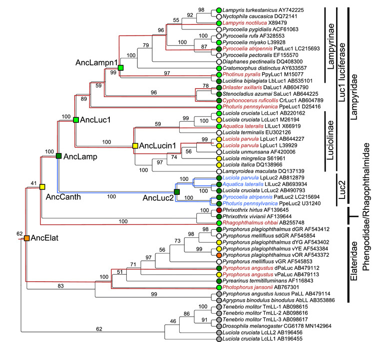
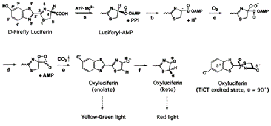
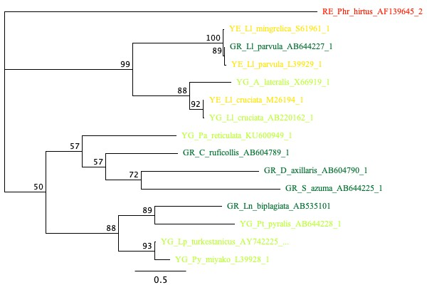
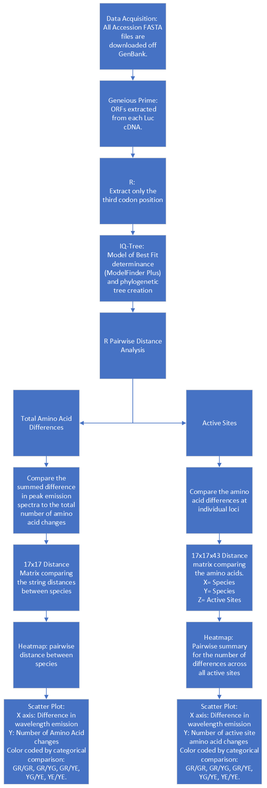
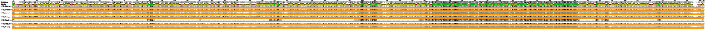
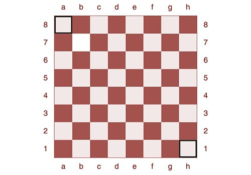
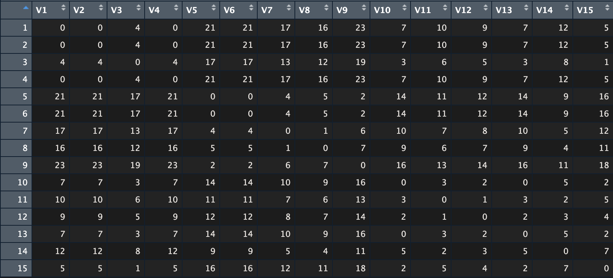
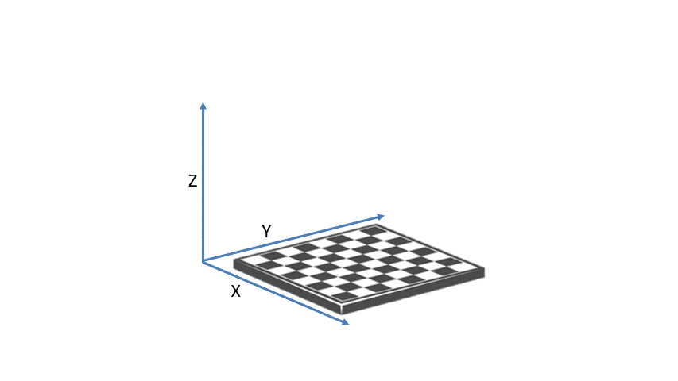

```{r setup, include=FALSE}
knitr::opts_chunk$set(echo = TRUE) #Knit function.


#Modified from Shane, 2010.
#The Packages required for this markdown.
list.of.packages <- c("stringdist", "abind", "stringr", "stats", "dplyr", "reshape2", "readxl", "tidyverse", "gplots", "plotly", "ggplot2", "dichromat") 
#Check if the packages exist in the user's packages directory.
new.packages <- list.of.packages[!(list.of.packages %in% installed.packages()[,"Package"])] 
#If not, install them.
if(length(new.packages)) install.packages(new.packages)

#Remove the Package vectors.
rm(list.of.packages, new.packages)


#Analysis.
  library(stringdist) #Matrixing. 
    #https://cran.r-project.org/web/packages/stringdist/stringdist.pdf
  library(abind) #Binding matrix to the next one.
    #https://cran.r-project.org/web/packages/abind/abind.pdf
  library(stringr) # Mutating the strings.
    #https://stringr.tidyverse.org
  library(stats) #Stat analysis 
    #https://stat.ethz.ch/R-manual/R-devel/library/stats/html/00Index.html
  library(dplyr) # Mutating dataframes.
    #https://dplyr.tidyverse.org
  library(reshape2) #mutating dataframes.
    #https://cran.r-project.org/web/packages/reshape2/index.html
  library(readxl) #Allows for reading excel file instead of .csv files. 
   #https://www.rdocumentation.org/packages/readxl/versions/1.4.2
  library(tidyverse) #Exportation and dataframe to fasta mutation. 
   #https://www.tidyverse.org/

#Plotting 
library(gplots)
#https://cran.r-project.org/web/packages/gplots/index.html
library(plotly)
#https://plotly.com/r/
library(ggplot2)
#https://ggplot2.tidyverse.org

#Visualization
library(dichromat)

```

### Abbreviation Key

```{r Abbreviations, echo =FALSE}

abbr <- read_excel("Supplementary Materials.xlsx", sheet = "Abbreviations")


knitr::kable(
  abbr,
  col.names = gsub("[_]", " ", names(abbr)),
  caption = 'The full name and abbreviation of all organisms used in this study.'
  )


```

# Introduction

     Bioluminescence, or the ability to produce and emit light by a living organism, is thought to be shared across five families of beetles: Elateridae, Lampyridae, Phengodidae, Rhaphthalmidae, and Sinophyrophoridae [@powellBeetleBioluminescenceOutshines2022]. Across these families, research has shown that it has emerged independently twice: once in click beetles (Elateridae) and another time in an ancestor of the lampyroid clade: Lampyridae, Rhagophtalmidae, Sinophyrophoridae, and Phengodidae [@fallonFireflyGenomesIlluminate2018; @kusyPhylogenomicRelationshipsBioluminescent2021; @martinTotalEvidencePhylogeny2017]. Furthermore, it is thought to be part of a gene duplication event at a common ancestor of the Lamyridae lineage, implicating that all fireflies have two bioluminescent genes: Luc1 and Luc2 [\@ref(fig:Figure2)]. However, so far this Luc2 isotype has only been isolated in *Ll. cruciate* and *Ll. parvula* [@bessho-ueharaIdentificationCharacterizationLuc2type2017]. This duplication allowed for fireflies to develop two different proteins that can be expressed for different needs. It is thought that Luc1 is predominately expressed in larvae, prepupae, pupae, and adults. Due to the match in visual sensitivity of *Ll. parvula* eyes to that of Luc1, its role is believed to be for intraspecific communication, unlike that of Luc2. Currently, only a few species have had the Luc2 gene isolated, but it is believed that the extant Luc2 is used to express a green glow in the eggs, prepupae, pupae, and adult females of *Ll. cruciate* and *Ll. lateralis* [@bessho-ueharaIdentificationCharacterizationLuc2type2017].

```{r, Figure2, fig.cap="Molecular phylogeny of luciferases and related enzymes. The leaf nodes are labeled with species name, protein name, and GenBank accession number. Branches are labeled with bootstrap probability (1000 reconstructions). The resurrected ancestral nodes are shown as a square. The leaf nodes are indicated with in vitro luminescent colors (green, yellow-green, yellow, orange, or red) judged by the luminescence maximum values: Green, GR, 520-549 nm; Yellow-green, YG, 550-559 nm; Yellow, YE, 560-584 nm [@obaResurrectingAncientGlow2020].", fig.align='center', out.width="80%", echo=FALSE}

    

```

     To produce light, the firefly luciferin is converted into an excited state oxyluciferin product (Figure \@ref(fig:luciferase)). Surprisingly, despite all fireflies using the same luciferin substrate, the wavelength emitted varies across the phylum [@branchini1999]. Typically, fireflies emit a peak emission spectra in vivo between 540-580nm (green to yellow light) [@hallEvolutionAdultLight2016; @navizetColorTuningMechanismFirefly2010; @ugarovaProteinStructureBioluminescent2002]. This difference in emission has a couple of different hypothesized reasons in fireflies. The most prominent factor researchers believe to be responsible is that amino acid substitutions in the active sites of Luciferase proteins results in a substantial alteration to a firefly's peak emission spectra [@branchini1999; @mortonSpectroscopicPropertiesFirefly1969]. Additionally, numerous researchers have shown that site specific amino acid changes results in a shift of the luciferase peak emission wavelength *in vitro* [@branchiniRoleActiveSite2001; @shapiroSetMulticoloredPhotinus2005; @wangImpactSiteDirectedMutant2013]. However, while these single point mutagenesis models show that these changes do influence the emission spectra emitted by firefly bioluminescence, firefly species have a significant number of mutations across the entire protein. As such, a couple of expected models can be generated. The first is that the entire protein complex matters when determining color, meaning the more amino acid differences between species, the greater the difference in absolute emission spectra. Or, an alternative could be that a firefly's light emission is dependent on the proteins at specific sites where the enzyme and substrate interact (known as active sites). In this system, it isn't the total number of changes, but the changes that occur at these active sites that influence the emission color of a firefly.

```{r luciferase, out.width="80%", fig.align='center', fig.cap="Mechanism of firefly luciferase catalyzed bioluminescence and TICT excited state of oxyluciferin [@branchini1999].", , echo=FALSE}



```

     In this paper, I analyze the evolutionary history of Luc1 within a subset of sixteen firefly species to elucidate a potential correlation between the protein structure of each species and the absolute difference in peak emission spectra. First, a phylogenetic tree was generated to determine potential phylogenetic correlation between species of interest and the wavelength emitted. Next, the firefly proteins were analyzed pairwise to determine if a correlation between the absolute difference in peak emission spectra and the differences in three different groups: all amino acids, non-active sites, and only active sites. I found that there is no evolutionary correlation and little, if any, pairwise correlation between these groups and that the peak emission spectra of a firefly is likely determined by a multitude of factors, not just the protein structure.

# Methods

## Phylogenetics

     Due to the redundancy of genetic code, there are different evolutionary pressures placed on different codon positions. Since the third codon is the least functionally constrained, mutations are more likely to occur there and be passed to the next generation [@bofkinVariationEvolutionaryProcesses2007]. This becomes a problem when attempting to create a phylogeny of pairwise distances, as these mutations could be cases of convergent evolution, causing improper clustering. As such, sixteen known Luc1 protein sequences (Table \@ref(tab:Species); Supplementary Table \@ref(tab:ST1)), were imported into Geneious Prime to have the *O*pen *R*eading *F*rame (ORF) extracted (for explicit steps see \@ref(geneious-prime-orf-extraction)).

```{r Species, echo=FALSE}

ST1 <- read_excel("Supplementary Materials.xlsx", sheet = "ST1")

species <- select(ST1, Species, GenBank_No., lmax_nm, `Colouration*`)

knitr::kable(
  species,
  col.names = gsub("[_]", " ", names(species)),
  caption = 'Organisms Studied and supplementary data about each. *Green, GR, 520-549 nm; Yellow-green, YG, 550-559 nm; Yellow, YE, 560-584 nm. (Modified from: @obaResurrectingAncientGlow2020)'
  )


```

     Next, these ORFs are brought into R to have the first and second codon position removed, leaving only the third codon to be analyzed.

```{r ThirdCodonExtraction, echo= TRUE, results='hide', class.source = 'fold-show'}

#Import Table.
  ORFs <- read.table("Phylogenetics/ORFs.txt", sep=",", header=FALSE)
#Blank Vector of the final nucleotides.
  only.third <- c() 

#Third Codon Removal.
for (species in ORFs$V2) { 
  #Split the nucleotides into single letter strings. 
    split <- strsplit(species,split = "")
  #Extract the third codon. 
    extracted <- str_remove_all(toString(split[[1]][seq(3, length(split[[1]]), 3)]), ", ")
  #Order of Operations:
    #create a string counting every third position into a new vector, remove those indexes into a new vector.
    #Add the string as a new index.
    only.third <- c(only.third, extracted) 
  
}
#Remove the intermediate vectors made in for-loop.
rm(split, extracted, species)

#Dataframe of the species name and the third codon-only files. 
third.codons.df <- data.frame(ORFs$V1, only.third)


#Modified from: TrainingPizza, 2021
  #Create a vector that can be exported as a .fasta
  third_codons_print <- 
    third.codons.df %>% 
    rowwise() %>%
    pivot_longer(ORFs.V1:only.third) %>%
    select(-name)
  
  #Export the dataframe as a .fasta.
  write.table(third_codons_print,
              file = "Phylogenetics/Thirdcodons_only.fasta",
              col.names = FALSE,
              row.names = FALSE,
              quote = FALSE)
```

     These third codon-only sequences were imported into BisonNet to construct a phylogenetic tree. Within the program IQ-Tree, ModelFinder Plus was used to determine the best substitution model that fits the nucleotide sequences using Akaike Information Criterion (AIC), removing the potential for convergent evolution to influence the phylogeny [@minhIQTREEVersionTutorials2019]. The chosen model is then used to assemble a tree within IQ-tree. The outgroup, *Phr. hirtus* (Accession AF139645), was selected as its luciferase protein is known to be derived from the same ancestral luciferase as Lampyridae [@obaResurrectingAncientGlow2020]. The .treefile was then imported into Geneious Prime and manually color-coded.

```{r IQ-TREE, eval=FALSE, class.source = 'fold-show'}

#!/bin/bash
#SBATCH -p short # partition (queue)
#SBATCH -N 1 # (leave at 1 unless using multi-node specific code)
#SBATCH -n 8 # number of cores
#SBATCH --mem-per-cpu=32G # memory per core
#SBATCH --job-name="IQtree" # job name
#SBATCH -o slurm.%N.%j.stdout.txt # STDOUT
#SBATCH -e slurm.%N.%j.stderr.txt # STDERR
#SBATCH --mail-user=_____ # address to email
#SBATCH --mail-type=ALL # mail events (NONE, BEGIN, END, FAIL, ALL)
#SBATCH --exclude=hpc-4,hpc-5,hpc-6


#Load module:
module load phylogeny


#Variables:
barcode=/home/arb027/CAPSTONE/ThirdCodon_alignment.fasta #The input file.
merit=AIC #Akaike Information Criteria Metric for IQ-Tree ModelFinder Plus.
outgroup=RE_Phr_hirtus_AF139645_2 #Sequence Identifier of the outgroup.
bootstrap=10000 #Number of bootstraps. 

#Print variables to console (for user references):
cat <<OPTIONS
Alignment file: $barcode
Search for the best model of sequence evolution using: $merit
Outgroup: $outgroup
Number of Bootstraps: $bootstrap
OPTIONS

#IQtree:
    #Documentation: http://www.iqtree.org/doc/Command-Reference
iqtree -s $barcode -merit $merit -o $outgroup  -bb $bootstrap

#Unload module:
module unload phlogeny 
```

## R Analysis

     The original nucleotide ORFs for the firefly proteins (were translated into protein sequences and aligned using MUSCLE (algorithm PPP, HMM Pertubations = 0, Guide Tree Purmutations = 0) in Geneious Prime to be imported into R. While 17 Luc1 proteins have previously been identified by @obaResurrectingAncientGlow2020 and were used to construct the phylogenetic tree, the *Pt. pyralis* Luc1 mRNA (Accession: M15077) only has 182 amino acids, while the other proteins have around 560 proteins. Additionally, later analysis looks into known active sites of the Luc1 protein using data from *Pt. Pyralis*, where the first known active site is at AA position 197. Even when aligned with MUSCLE, a significant majority of the outlined active sites are not aligned with the other proteins (Supplementary Figure \@ref(fig:STF2). Further research into this mRNA protein would be required to determine where the active sites are located within this specific protein. However, there is another known luc1 mRNA protein for Pt. pyralis (Accession: AB644228) that does properly align to other proteins (Supplementary Materials \@ref(fig:STF2)). By looking across the previously outlined categories in Supplementary Figure \@ref(tab:ST1) (Green, GR, 520-549 nm; Yellow-green, YG, 550-559 nm; Yellow, YE, 560-584 nm), these proteins, along with the emission spectra of each species at a pH of 7.8, were then analyzed to determine the absolute pairwise distance between each species' emission spectra.

```{r GlobalVars, echo=FALSE, class.source = 'fold-show'}

#Create vector from the aligned column of the master Supplementary Materials excel file. 
  proteins <- read_excel("Supplementary Materials.xlsx", sheet = "Proteins")#DF of just the species name and peak emission. 
  emission <- select(proteins, Name, Lmax) 


#Modified from (Amos, 2018)
  diffmat = function(x){
    #Column/vector to blank matrix with dimensions as the number of rows in the input. 
    D = matrix(as.numeric(NA), NROW(x), NROW(x)) 
    #Difference between each site.
      for (i in 1:NROW(x)){
      d = x[[i]] - x[-i]
      D[i,-i] = d
    }
    #Checking the matrix was created correctly. 
      if (!all(is.na(diag(D)))){
        stop("Not all diagonal elements zero")
      }
      diag(D) = 0
      if (!is.null(names(x))) colnames(D) = rownames(D) = names(x)
      return(D)
  }
            
#Create an absolute diff in emission matrix using function above. 
  abs.diff.emission.matrix <- abs(diffmat(emission$Lmax))

#Names
  colnames(abs.diff.emission.matrix) <- proteins$Name
  rownames(abs.diff.emission.matrix) <- proteins$Name

#Matrix -> dataframe
  abs.emission.diff.df <- melt(abs.diff.emission.matrix, varnames = c("Species1", "Species2"))
  colnames(abs.emission.diff.df)[3] <- "abs.emission.diff" #Name the new column.


#Create the master dataframe from which other code chunks are added to. 
  combined.df <- abs.emission.diff.df

```

     To determine the total amino acid differences, the package stringdist was used to create a pairwise distance matrix at each amino acid site using the Hamming Distance Metric: "count the number of character substitutions that turns b into a, if a and b have different number of characters the distance is Inf" [@stringdist]. For those curious towards the analysis protocol used, see \@ref(pairwise-distance-matrix).

```{r All Amino acid sites, echo = TRUE, class.source = 'fold-show'}

  align.vector <- as.vector(proteins$aligned)
#Determine the total length of the aligned proteins vector.
  sites <- nchar(align.vector[1])
  
  
  
#Matrix of all amino acid sites
  sum.all.matrix <- as.matrix(stringdistmatrix(align.vector, method = "hamming"))

#Names. 
colnames(sum.all.matrix) <- proteins$Name
rownames(sum.all.matrix) <- proteins$Name

#Matrix to df.
sum.all.df <- melt(sum.all.matrix, varnames = c("Species1", "Species2"))
#Name Column. 
colnames(sum.all.df)[3] <- "AllDiff"

#Merge into the master dataframe. 
combined.df <- merge(combined.df, sum.all.df)

```

     A similar method was employed for both calculating the number of differences excluding the amino acid active sites and a separate 3-D matrix for only the active sites. The active sites for *Pt. Pyralis* have previously been identified by @leachViewActiveSite2008 [Table \@ref(tab:ST2)]. During alignment, ten sites were added to the *Pt. Pyralis* protein (Supplementary Figure \@ref(fig:STF2)), so these active sites were mutated by ten for analysis.

```{r Importation, echo=TRUE, results='hide', class.source = 'fold-show'}

#Active site Table
  activesites.table <- read_excel("Supplementary Materials.xlsx", sheet = "ST2", )
#Table to vector including adjusting for alignment (+10).
  activesites <- activesites.table$Site + 10 

```

     To analyze the number of amino acid differences excluding the active sites, a modified version of stringdistmatrix was used to create a vector of all 522 amino acids that are not known active sites. For each index of the vector, a pairwise distance was then calculated, giving a matrix of 0s and 1s, where 0 indicates no difference and 1 equals a difference at the specific site. As each site was calculated, it was mutated to a three dimensional matrix along the z-axis, giving a 15x15x521 matrix. This matrix was then summed down the z axis to give the total number of differences between each species luciferase protein (See \@ref(visualization) for a detailed breakdown of matrix dimensionality with visualization).

```{r NoActiveSites, echo=TRUE, class.source = 'fold-show'}
#Get a vector of the total number of amino acid sites. 
  sites <- c(1:nchar(align.vector[1]))

# Create the first pairwise matrix. 
  all.Distmatrix1 <- as.matrix(stringdistmatrix(str_sub(align.vector, 1, 1), method = "hamming")) 
  #Order of Operations:
  #str_sub: Create a vector of the protein at the first active site. 
  #stringdistmatrix: Does a simple comparison matrix between each group (0 = identical, 1 = difference) using Hamming methodology (counts the number of character substitutions that turns b into a. If a and b have different number of characters the distance is Inf [If a string has a length greater than 1 it causes an error, making this self checking]).
#Remove both the first site that was analyzed and all of the active sites. 
  sites <- sites[-c(1, activesites)]

#Create the array using the first matrix.
  noactive.matrix <- array(data=c(all.Distmatrix1), dim = c(length(align.vector), length(align.vector),1))

#Loop all the sites selected. 
  for (site in sites) { 
    #Same logic as the first matrix.
      single <- as.matrix(stringdistmatrix(str_sub(align.vector, site, site), method = "hamming"))
     #Append the new matrix along the z axis.
      noactive.matrix <- abind(single, noactive.matrix, along = 3)
}

#Add up the total number of differences between each protein by summing down the z axis (dims = 2).
  sum.noactive.matrix <- as.matrix(rowSums(noactive.matrix, dims = 2)) 

#Names. 
  colnames(sum.noactive.matrix) <- proteins$Name
  rownames(sum.noactive.matrix) <- proteins$Name

#matrix to df.
  sum.noactive.df <- melt(sum.noactive.matrix, varnames = c("Species1", "Species2"))
#Name Column. 
  colnames(sum.noactive.df)[3] <- "NoActiveDiff"

#Merge to master. 
  combined.df <- merge(combined.df, sum.noactive.df)

```

     A similar pairwise distance metric was then used but instead of analyzing the amino acids *without* the active sites, this time the 3D matrix was created only at the active sites, creating a 15x15x43 pairwise matrix that was then summed along the z axis. This matrix was then mutated into a dataframe for analysis (See \@ref(matrix-to-dataframe) for visualization).

```{r ActivesitesOnly, results = 'hide', echo=TRUE, class.source = 'fold-show'}
#Create the first matrix 
  activesites.Distmatrix1 <- as.matrix(stringdistmatrix(str_sub(align.vector, activesites[[1]], activesites[[1]]), method = "hamming")) 
#Order of Operations:
  #str_sub: Create a vector of the protein at the first active site. 
  #stringdistmatrix: Does a simple comparison matrix between each group (0 = identical, 1 = difference) using Hamming methodology (counts the number of character substitutions that turns b into a. If a and b have different number of characters the distance is Inf [If a string has a length greater than 1 it causes an error, making this self checking]).
  
#Remove the analyzed site from the vector to prevent repeat analysis. 
  activesites <- activesites[-1]

#Create the array using the first matrix as our input data. 
  activesites.matrix <- array(data=c(activesites.Distmatrix1), dim = c(length(align.vector), length(align.vector),1))

  
#Looping all the matrix sites. 
for (site in activesites) { 
#Same as the first matrix. 
  single <- as.matrix(stringdistmatrix(str_sub(align.vector, site, site), method = "hamming")) 
#Append the new matrix along the z axis to the 3D array. 
  activesites.matrix <- abind(single, activesites.matrix, along = 3) 
}

#Distance matrix summed.
  activesites.dist.all.matrix <- rowSums(activesites.matrix, dims = 2)
  #Add up the total number of differences between each protein by summing down the z axis (dims = 2).

#Distance output
  activesites.dis.all.dist <- as.dist(rowSums(activesites.matrix, dims = 2)) 
  #This is for user reference, it is not analyzed by the script. 

#Name the Matrix. 
  colnames(activesites.dist.all.matrix) <- proteins$Name
  rownames(activesites.dist.all.matrix) <- proteins$Name

#matrix -> dataframe. 
  activesites.dist.all.df <- melt(activesites.dist.all.matrix, varnames = c("Species1", "Species2"))
#Name the new column
  colnames(activesites.dist.all.df)[3] <- "ActiveSitesOnly"

#Merge this dataframe with the master dataframe. 
  combined.df <- merge(combined.df, activesites.dist.all.df)
```

     The dataframe containing the species compared, the emission spectra, and the number of differences at the three groups was then cleaned to remove any self comparisons and duplicate comparisons created during the conversion from a matrix to dataframe.

```{r Cleaning, echo=TRUE, results='hide', class.source ='fold-show'}

#Logic found at:https://stackoverflow.com/questions/23474729/convert-object-of-class-dist-into-data-frame-in-r
#Remove Duplicates and 
  #Sort the two columns.
    names <- t(apply(combined.df[,c(1,2)],1,FUN=sort)) 
  #Find rows comparing the same organism. 
    same <- which(names[,1] == names[,2]) 
  #Merge names columns into single column separated by |.
    names    <- paste(names[,1],names[,2],sep="|") 
  #find duplicate comparisons.
    dups <- which(duplicated(names)) 
  # Remove any same organism or duplicates 
  combined.df <- combined.df[-c(same, dups),] 

rm(dups, names, same)

combined.df$Species1 <- gsub('_', ' ', combined.df$Species1)
combined.df$Species2 <- gsub('_', ' ', combined.df$Species2)

#Only get the wavelength emission spectra of the species
combined.df$Species1.abr <- str_sub(combined.df$Species1, 1,2)
combined.df$Species2.abr <- str_sub(combined.df$Species2, 1,2)


#Abr col comparison
combined.df$Comparison.abr <- str_c(combined.df$Species1.abr, "/", combined.df$Species2.abr)
#Full Name Comparison
combined.df$Comparison.full <- str_c(combined.df$Species1, "/", combined.df$Species2)


#organize the comparisons from green to yellow. 
combined.df$Comparison.abr <- factor(combined.df$Comparison.abr, levels = c("GR/GR", "GR/YE", "GR/YG", "YG/YG", "YE/YG", "YE/YE"))


colors <- c("#074000", "#aeff17", "#66db00", "#699647", "#26b530", "blue")

```

     Finally, these pairwise comparisons were graphed using a combination of ggplot2 [@R-ggplot2], gplots [@R-gplots], and plotly [@R-plotly] to create both heatmaps of the summed differences and scatterplots comparing the absolute change in emission spectra vs. the difference in amino acid residues. For a visualized workflow, see \@ref(fig:STF1).

# Results

## Phylogenetics

After extracting the third codon only and running IQ-tree, a maximum likelihood tree was built using GTR+F+G4 as the selected substitution model. As shown in Figure \@ref(fig:Phylogenetics), no monophyletic grouping was established between different color categories. Furthermore, the two *Li. cruciata* group together into a unique clade, despite having different emission spectra. While this tree does have low bootstrap support values, it has similar branching to that of @obaResurrectingAncientGlow2020, providing support to the evolutionary history of this tree.

```{r Phylogenetics, fig.cap="Phylogenetic tree of the analyzed species (Bootstraps = 10,000, metric = AIC), Color-coding manually mutated.", fig.align='center', out.width="1100%", echo=FALSE}

    

```

## Pairwise Distance Analysis

The three different arrays were summed along the z axis into three 2-dimensional matrices, which were then plotted as a heatmap and against the absolute difference in emission spectra:

```{r AllSitesHeatmap, fig.align='center', fig.cap="Heatmap displaying the total number of amino acid differences between each species."}


heatmap.2(sum.all.matrix, 
          Rowv = FALSE, 
          Colv = FALSE, 
          dendrogram = "none", 
          symm = TRUE, 
          scale = "none", 
          trace = "none", 
          margins = c(11.5,10), 
          cellnote = sum.all.matrix,
          notecol = "black", 
          cexRow = 0.7
          )
```

```{r AllSitesScatterPlot, fig.align='center', fig.cap="Interactive scatter-plot of the absolute change in emission spectra vs. the total number of amino acid differences between each species.", warning=FALSE}
sum.all.plot <- ggplot(combined.df, 
                                  aes(x = abs.emission.diff,
                                      y=AllDiff, 
                                      color=Comparison.abr, 
                                      label = Comparison.full,
                                      shape=Comparison.abr)) + 
  geom_point() + 
  theme_classic() + 
  stat_ellipse() + 
  scale_color_manual(values = colors) +
  xlab("Absolute ∆ Emission Spectra") +
  ylab("Total Number of AA Differences") + 
  labs(color = "Comparison Group", shape = "Comparison Group")
  
#Interactive plot
  ggplotly(sum.all.plot) 

```

```{r NoActiveHeatmap, fig.align='center', fig.cap="Heatmap displaying the total number of amino acid differences, excluding active sites, between each species."}
heatmap.2(sum.noactive.matrix, 
          Rowv = NA, 
          Colv = NA, 
          dendrogram = "none", 
          symm = TRUE, 
          scale = "none", 
          trace = "none", 
          margins = c(11.5,10), 
          cellnote = sum.noactive.matrix, 
          notecol = "black", 
          cexRow = 0.7
          )
```

```{r ScatterNoActive, fig.align='center', fig.cap="Interactive scatter-plot of the absolute change in emission spectra vs. the total number of amino acid differences, excluding active sites, between each species.", warning=FALSE}
#ggplot2 - All aesthetics are self-explainatory. 
sum.noactive.plot <- ggplot(combined.df, 
                                  aes(x = abs.emission.diff,
                                      y=NoActiveDiff, 
                                      color=Comparison.abr, 
                                      label = Comparison.full,
                                      shape=Comparison.abr)) + 
  geom_point() + 
  theme_classic() + 
  stat_ellipse() + 
  scale_color_manual(values = colors) +
  xlab("Absolute ∆ Emission Spectra") +
  ylab("Total Number of AA Differences w/o Active Sites") +
  labs(color = "Comparison Group", shape = "Comparison Group")
  
#Interactive plot.
  ggplotly(sum.noactive.plot) 

```

```{r ActiveSitesHeatmap, fig.align='center', fig.cap="Heatmap displaying the total number of active site amino acid differences between each species."}
heatmap.2(activesites.dist.all.matrix, 
          Rowv = NA, 
          Colv = NA, 
          dendrogram = "none", 
          symm = TRUE, 
          scale = "none", 
          trace = "none", 
          margins = c(11.5,10), 
          cellnote = activesites.dist.all.matrix, 
          notecol = "black", 
          cexRow = 0.7
          )
```

```{r ActiveSitesScatter, fig.align='center', fig.cap="Interactive scatter-plot of the absolute change in emission spectra vs. the total number of active site amino acid differences, excluding active sites, between each species.", warning=FALSE}
sum.activeonly.plot <- ggplot(combined.df, 
                                  aes(x = abs.emission.diff,
                                      y=ActiveSitesOnly, 
                                      color=Comparison.abr, 
                                      label = Comparison.full,
                                      shape=Comparison.abr)) + 
  geom_point() + 
  theme_classic() + 
  stat_ellipse() + 
  scale_color_manual(values = colors) +
  xlab("Absolute ∆ Emission Spectra") +
  ylab("Total Number of Active Sites AA differences") +
  labs(color = "Comparison Group", shape = "Comparison Group")
  
#Interactive plot
  ggplotly(sum.activeonly.plot) 

```

     Across all of these figures, no correlation between the emission spectra emitted and the number of amino acid differences could be elucidated. The intracomparisons of the yellow group reveals that despite the *Ll. cruciata* having a maximum difference in emission spectra of 8nm (*Ll parvula*, 568nm), this species has over 100 total amino acid differences between each other yellow species. This is in sharp contrast to other intra-color specie comparisions who only have between 6 and 28 total amino acid differences. Additionally, when brought to the level of active sites, the yellow species had 0 differences in amino acid residues, with the exception of *Ll. cruciata* with 2 differences. In other words, all of the amino acid differences were found in areas that are not directly interacting with the luciferin substrate.

     Of particular interest are 2 *Li. cruciata* Luc1, one that emits a peak wavelength of 565nm (yellow, Accession #M26194), and the other which emits a peak wavelength of 554 (yellow-green wavelength, Accession #AB220162). While most other species have multiple amino acid differences at both all amino acids and the active sites, these two species have only 5 amino acid differences at non-active sites, and an absolute change in peak emission spectra of 7.

     For the other color categories, while the intra-comparisons have a slightly lower number of differences than inter-group comparisons, there is still a high degree of differences in emission spectra. Even when accounting for just active sites, there is even less of a correlation as each group was highly overlapping with each other. Furthermore, there are a couple of comparisons where despite having no difference in peak emission wavelength, there is a difference in amino acid residues. Collectively, these graphs show that the amino acid residues are not the most significant contribution towards the color emission emitted during bioluminescence.

# Discussion

     Phylogenetically, this data shows that there is no evolutionary correlation to the wavelength spectra emitted by a firefly. Comparing this tree to that of @obaResurrectingAncientGlow2020 (Figure \@ref(fig:Figure2)), it is interesting to see the species are grouping similarly along the phylogenetic lineage, despite Oba et al. undergoing a difference series of steps and using a different substitution model (JTT matrix vs GTR+F+G4). Since the mutations undertaken removed the possibility of convergent evolution, this data suggests that evolutionarily, the amino acid residues present within a species are not a primary determinant of the color spectra emitted. If this were the case, it would be expected to see the tree start with red (the designated outgroup color) and have monophyletic clades of yellow, yellow-green, and green, identical to that of the color spectrum.

     These conclusions are further backed by the heat-maps and scatter-plots showing little to no correlation between the number of amino acid differences and the absolute change in peak emission spectra. In fact, the results of the whole protein and without active site analysis suggests that despite having a high number a high number of differences in amino acid residues across the whole protein, there is a small change in the absolute emission spectra between comparison colors.

     Furthermore, the intra- and inter-categorical comparisons having a large number of differences in amino acid residues despite having a small change in peak emission spectra suggests that a significant portion of the amino acid residues do not play a role in the emission spectra a species emits. However, further testing would be required to support this hypothesis.

     Looking into active sites, the yellow wavelength category having 0 active site differences, with the exception of *Ll. cruciata* which has 2 differences, despite continuing to have a difference in peak emission spectra. While this subset suggests that the residues at an active site could play some role in the wavelength emitted by a species, as indicated by the differences in amino acid residues when compared to other color groups, the other categories reject this by *Ll. cruciata* (yellow), having no active site differences to *Ll. cruciata* (yellow-green) and *A. lateralis*, despite having an absolute change in emission spectra of 8 and 10 respectively.

     There is even less of a correlation with each group being highly spread across the scatterplot and not clustering into distinct groups or along a linear model as predicted. These few, if any, number of differences across over 40 amino acid active sites indicates that these sites could likely be under some form of constraint to enable bioluminescence within the firefly, however further testing would be necessary to confirm such possibilities.

     Alternatively, it could be that the number of changes is not what matters, but the specific amino acid present. As previously stated, single point mutagenesis studies have shown the affect a single amino acid residue can have on the emission spectra of a luciferase protein [@branchiniRoleActiveSite2001; @shapiroSetMulticoloredPhotinus2005; @wangImpactSiteDirectedMutant2013]. Additionally, it has been found that the wavelength emitted by a luciferase enzyme is dependent on pH [@vivianiProtonMetalBinding2018]. Furthermore, @zhao2005 showed that by increasing the temperature of luciferase, the brightness and emission spectra is redshifted. Since majority of these samples were collected in the field, the temperature at the time of collection would skew the true peak emission spectra of a species luciferase. Finally, the luciferase reaction occurs internally, meaning any light emitted by a firefly must travel through the body of the firefly before being detected by either a machine or human eyes. It is highly plausible that the depth at which the luciferase reaction occurs and the composition of the cuticle plays a significant role in the emission spectra seen by fireflies. Despite luciferase being prominently used in biology and the medical industry for bioluminescent imaging, no research was found on the effect of either parameter on the emission spectra of luciferase, leaving this hypothesis unconfirmed.

# Conclusions

     This study was unable to support the hypothesis that the number of amino acid differences (whether that be across the entire protein or at a protein's active sites) does conclusively determine the wavelength spectra emitted by a firefly. While these differences might play some role, as supported by mutagenesis studies, it is much likely to be a combination of variables that alter the emission spectra emitted. This means that while the differences could play some role, the current datasets and analysis do not allow for conclusive testing towards the exact relationship different amino acids at various positions play in firefly bioluminescence. Furthermore, in order to elucidate the true correlation between all factors (pH, temperature, filtration, etc.), even more extensive research would need to be done to allow for both detection within the light organ itself, and later isolation of the luciferase compound for further study. Although none of these are likely to be seen anytime soon, this study does enable future researchers to begin to understand the influence of amino acid residues and act as a springboard to higher analysis and investigation.

# Supplementary Files

## Data Availability

All files used in this project is available within respective folders in the project directory.

     For users wishing to replicate any code chunks, all required libraries can be installed running the included Package.Installer.R file. Otherwise, downloading and editing this .Rmd file has the necessary commands built-in to install any missing packages. However, it is HIGHLY advised that only those with a solid understanding of R attempt to alter any functions or code chunks.

## Tables

### Supplemental Table 1

```{r ST1, echo =FALSE,}

knitr::kable(
  ST1,
  col.names = gsub("[_]", " ", names(ST1)),
  caption = 'Organisms Studied and supplementary data about each. **Green, GR, 520-549 nm; Yellow-green, YG, 550-559 nm; Yellow, YE, 560-584 nm. (Modified from: @obaResurrectingAncientGlow2020)'
  )
```

### Supplemental Table 2

```{r ST2, echo =FALSE,}

knitr::kable(
  activesites.table,
  col.names = gsub("[_]", " ", names(activesites.table)),
  caption = 'Active Sites used in this study (Modified from: @leachViewActiveSite2008)'
  )
```

## Figures

### Supplementary Figure 1

```{r STF1, fig.cap="Workflow", fig.align='center', out.width="1100%", echo=FALSE}

    
```

### Supplemental Figure 2

```{r STF2, fig.cap="MUSCLE Alignment Data, of particular note is the misalignment to the active sites of the *Pt. pyralis* Luc1 (Accession: M15077), which was further excluded from analysis due to the presence of a second known Luc1 protein for *Pt. pyralis*", fig.align='center', out.width="1100%", echo=FALSE}

    

```

## Supplemental Code:

### Geneious Prime ORF Extraction

```{r Primesteps, echo=FALSE, results='markup', fig.cap="Steps taken using Geneious Prime to extract the ORFs and bring them into R.",}
cat("Step (File Path): 
 1. Download sequences from GenBank.
 2. Import the Raw Luciferase Proteins (SupplementaryFiles/Luciferase_raw_sequences.fasta).
 3. Identify the ORFs and export into a new file (SupplementaryFiles/Luciferase_ORFs.fasta). 
 4. Exported as .txt file for analysis (Phylogenetics/ORFs.txt). 
 a. The .txt file was chosen as it allowed for less manual mutations to alter into a csv than the built in .csv export function in Geneious Prime.
 ")
```

### Pairwise Distance Matrix

#### Logic

     Below is the logic used by the stringdistmatrix function in the package stringdist that I wrote while determining how to only analyze the active sites. From a precursory glance using getAnywhere() and other source code viewing functions, the way stringdist integrates is much more compact and uses functions that are faster when used in R, but comes at the cost of being difficult to replicate and explain to others who have an introductory level in computer science. As such, I wrote my own version that creates a comparison matrix at each site, allowing for easy visualization to a non-computer scientist. For each cell in the matrix, a 0 indicates the proteins are identical between two species (indicated by row and column name), while a 1 indicates the proteins are different. Since these proteins were aligned, the Hamming method was chosen to act as an alignment checker since if string A does not have the same length as String B, the result is Infinite which causes later code to fail. Each matrix is then aligned into a three dimensional matrix to be summed down the z axis for the total number of differences These 3D arrays were then summed across each cell to determine the total distance between each Luc1 protein, which were then plotted.

```{r ForLoopWriting, eval=FALSE, echo=TRUE, fig.cap= "The logic likely used by stringdistmatrix and the logic I used when writing my active site code.", class.source = 'fold-show'}
#Prevents redundancy of vector creation.
  align.vector <- as.vector(proteins$aligned)
#Determine the total length of the aligned proteins vector.
  sites <- nchar(align.vector[1])
  
#Create first matrix. 
  all.Distmatrix1 <- as.matrix(stringdistmatrix(str_sub(align.vector, 1, 1), method = "hamming")) 
    #Order of Operations:
      #str_sub: Create a vector of the protein at only the first site. 
      #stringdistmatrix: Does a simple comparison matrix between each group (0 = identical, 1 = difference) using Hamming methodology [If a string has a length greater than 1 it causes an error, making this self checking].

#Create the array using the first matrix
  all.matrix <- array(data=c(all.Distmatrix1), dim = c(length(align.vector), length(align.vector),1))


#Repeat the matrix for all other sites within the protein
for (site in 2:sites) { 
  single <- as.matrix(stringdistmatrix(str_sub(align.vector, site, site), method = "hamming"))#Same as first matrix
  all.matrix <- abind(single, all.matrix, along = 3) #Append the new matrix along the z axis.
}

#Summed Matrix. 
  sum.all.matrix <- as.matrix(rowSums(all.matrix, dims = 2))
  #Add up the total number of differences between each protein by summing down the z axis (dims = 2).
  
#Names. 
colnames(sum.all.matrix) <- proteins$Name
rownames(sum.all.matrix) <- proteins$Name

#matrix to df
sum.all.df <- melt(sum.all.matrix, varnames = c("Species1", "Species2"))
colnames(sum.all.df)[3] <- "AllDiff"

#Merge into the master dataframe. 
combined.df <- merge(combined.df, sum.all.df)
```

#### Visualization

     Similar to a chess board, a pairwise matrix is defined into cells that can be indexed based on the row and column number/letter. For instance, in chess the index [D4] corresponds to the cell at the fourth column (D), fourth row of the chess board (4) (Figure \@ref(fig:Chessboard)). Similarly, the index of a matrix corresponds to a specific point based upon the row and then the column (meaning [2,1] is the second row, first column).

```{r Chessboard, fig.cap="An example chessboard and matrix [@HowSetChessboard].", fig.align='center', out.width="1100%", echo=FALSE}

    
```

```{r Matrix, fig.cap="An example chessboard and matrix [@lancashire3000MappingTensorNotation2022].", fig.align='center', out.width="1100%", echo=FALSE}


knitr::include_graphics("Images/Matrix.png")
```

     In a pairwise distance matrix, the row and column represent a specific species, and the cell represents the result of a comparison between the two. In this study, that comparison is two things: the emission spectra, and the amino acid residue at specific sites. For the emission spectra, this is taken using the absolute difference between the species.

```{r EmissionMatrix, fig.cap="The absolute difference in emission between each species.", fig.align='center', out.width="1100%", echo=FALSE}



```

     On the other hand, since the proteins are letters instead of numbers, a binary system must be used in which the differences are either 0s (indicating identical amino acid residues) or 1s (indicating a difference in amino acid residues). However, this only gives the differences at one point. Therefore, when doing a pairwise difference across the entire protein, a pairbased matrix must be created at each point. In order to not have a unique vector for each matrix, we can use 3-dimensional arrays in which one matrix (a chessboard) is stacked on top of another matrix (Figure \@ref(fig:gif)). This array is then summed through the z-axis to produce a single matrix with the total number of differences between each species.

```{r gif, fig.cap="Visual demonstration of stacking matrices to create a 3-dimensional matrix.", fig.align='center', out.width="1100%", echo=FALSE}



```

## Matrix to Dataframe

Take the distance matrix:

```{r}
values <- c(0,1,2,3,4,5)

matrix <- abs(diffmat(values))
matrix 
```

Using the melt function, we get the output below, where the row represents the first column, the column recommends the second column, and the distance value represents the third column.

```{r Melt, echo = FALSE,results='markup'}

df <- melt(matrix, varnames = c("Row", "Column"))
#Name Column. 
  colnames(df)[3] <- "Value"
df
```

However since the diagonal of the matrix is a self comparison, this would not be an apt comparison. So these values can be removed with the simple logic function:

```{r self, echo = TRUE, results='markup'}

#Extract columns 1 and 2 from the master dataframe:
df.names <- t(apply(df[,c(1,2)],1,FUN=sort)) 

#Find rows where the number in column one is identical to the number in column two. 
    df.same <- which(df.names[,1] == df.names[,2]) 
  
df <- df[-(df.same),]
df
```

Additionally, a comparison of #1 v. #2 is going to produce the same value as the comparison #2 v. #1 since a matrix is symmetrical down the diagonal. As such, these values need to be removed for comparison:

```{r Dups, echo = TRUE, results='markup'}
#Merge names columns into single column separated by |.
    df.names <- paste(df.names[,1],df.names[,2],sep="|") 
  #find duplicate comparisons.
    df.dups <- which(duplicated(df.names)) 
df <- df[-(df.dups),]
df
```

# References
